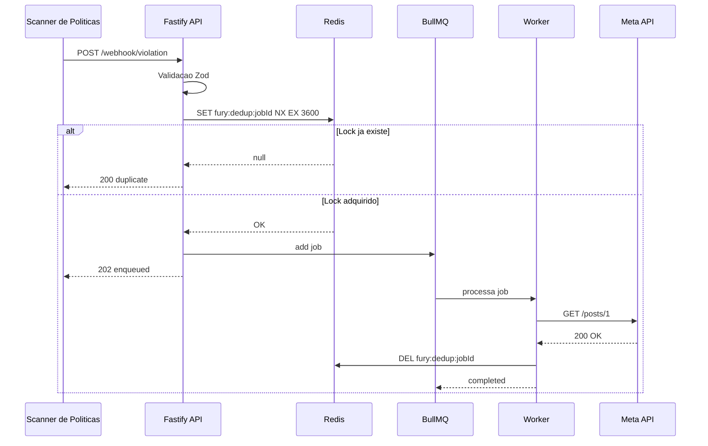

# FURY - Takedown Processor

Projeto desenvolvido como desafio técnico para a Click Hero, uma startup SaaS de automação de marketing. O FURY é o módulo responsável por receber violações de anúncios, enfileirar as ações de remoção e garantir que tudo aconteça de forma confiável, sem duplicatas e com rastreabilidade completa.

---

## Como surgiu esse projeto

Recebi o desafio e fui montando a arquitetura na cabeça antes de escrever qualquer linha de código. A ideia era simples: um webhook chega avisando que um anúncio violou alguma regra, o sistema precisa enfileirar uma ação de remoção e garantir que isso não aconteça duas vezes para o mesmo anúncio ao mesmo tempo.

Usei o Claude para construir a estrutura inicial com base nas decisões que tomei: qual framework usar, como organizar as pastas, como implementar cada camada. Durante o processo fui avaliando o que foi gerado, testando na prática e identificando onde o comportamento não batia com o que eu esperava. Os erros que encontrei estão documentados mais abaixo, junto com o raciocínio que usei para corrigir cada um.

O código final é resultado dessas iterações, onde eu definia o problema e a solução esperada e o Claude ajudava a implementar. Nada foi aceito sem teste real.

---

## O que o sistema faz

Quando um anúncio viola uma regra de política (termo proibido, violação de marca, problema de compliance), um webhook chega no sistema com as informações da violação. O sistema valida esse payload, verifica se já existe um job em andamento para aquele anúncio, enfileira o job de remoção e retorna imediatamente. O processamento acontece em background.

O worker consome a fila e faz a chamada para a Meta API (simulada com JSONPlaceholder nesse projeto). Se a chamada falhar por problema no servidor, ele tenta de novo com espera crescente entre as tentativas. Se falhar por erro do cliente (4xx), ele abandona sem tentar de novo porque sabe que não vai adiantar.

---

## Stack

- Node.js com TypeScript
- Fastify como framework HTTP
- Zod para validação dos payloads
- BullMQ para gerenciamento da fila
- Redis como backend da fila
- Axios para chamadas HTTP externas
- Pino para logs estruturados
- Bull Board para dashboard visual da fila
- Docker Compose para subir o Redis

---

## Estrutura de pastas

```
src/
├── app.ts
├── server.ts
├── config/
│   ├── env.ts
│   └── redis.ts
├── modules/
│   ├── webhook/
│   │   ├── webhook.schema.ts
│   │   ├── webhook.controller.ts
│   │   └── webhook.routes.ts
│   ├── jobs/
│   │   ├── jobs.controller.ts
│   │   └── jobs.routes.ts
│   └── takedown/
│       ├── takedown.types.ts
│       ├── takedown.queue.ts
│       ├── takedown.service.ts
│       └── takedown.worker.ts
├── services/
│   └── meta-api.service.ts
├── shared/
│   ├── logger/
│   │   └── logger.ts
│   ├── utils/
│   │   ├── request-id.ts
│   │   └── duration.ts
│   └── errors/
│       └── app-error.ts
└── dashboard/
    └── bull-board.ts
```

Cada módulo tem responsabilidade única. O webhook recebe e valida. O takedown gerencia fila, worker e a lógica de negócio. O jobs expõe o status. Os serviços compartilhados (logger, utils) ficam separados porque são usados em vários lugares.

---

## Arquitetura

O fluxo passa por cinco camadas antes de chegar na API externa:

```
POST /webhook/violation
        |
  Validação Zod
        |
  Lock Redis (SETNX)    <-- idempotencia atomica
        |
  Fila BullMQ
        |
  Worker (background)
        |
  Meta API (Axios)
```

### Camada de entrada (Fastify)

O Fastify foi escolhido no lugar do Express por ter suporte nativo a TypeScript, performance melhor e hooks de ciclo de vida que facilitam logging centralizado. Cada request recebe um UUID gerado pelo `genReqId` do Fastify. Esse ID aparece em todos os logs daquela requisição, do webhook até o worker.

### Validação (Zod)

O schema Zod define exatamente o que o sistema aceita. Se qualquer campo estiver errado, retorna 400 com os erros por campo, sem nenhum `any` no código. A validação acontece antes de qualquer coisa, evitando que dados ruins entrem na fila.

### Idempotencia (Redis SETNX)

Esse foi o ponto mais crítico do projeto. A regra de negócio é: o mesmo anúncio não pode ter dois jobs de remoção rodando ao mesmo tempo.

A primeira implementação usava `getJob()` para verificar se o job existia antes de criar um novo. O problema: com dois requests chegando ao mesmo tempo, os dois passavam pela verificação antes de qualquer um ter criado o job. Era uma race condition clássica.

A solução foi usar `SET key value EX 3600 NX` do Redis, que é atômico por definição. Ou você adquire o lock ou não adquire, sem janela de tempo entre verificar e escrever. Quando o job termina (com sucesso ou falha), o worker deleta o lock para permitir reprocessamento.

### Fila (BullMQ)

```
attempts: 3
backoff: exponential, base 2000ms
  tentativa 2: aguarda 2s
  tentativa 3: aguarda 4s
```

O BullMQ persiste os jobs no Redis. O estado fica disponível para consulta via `GET /jobs/:id`. O dashboard visual fica em `/admin/queues`.

### Worker

O worker distingue dois tipos de erro antes de decidir se vai tentar de novo:

- Erros 4xx: problema no request, não no servidor. Tentar de novo vai gerar o mesmo erro. O worker usa `UnrecoverableError` do BullMQ para mover o job direto para failed sem usar as tentativas restantes.
- Erros 5xx e timeout: problema temporário no servidor externo. O worker relança o erro e o BullMQ agenda a próxima tentativa com o backoff configurado.

---

## Erros encontrados durante o desenvolvimento

### Erro 1: BullMQ rejeita ":" no jobId

Quando fui testar pela primeira vez, o endpoint retornou 500 com a mensagem `Custom Id cannot contain :`.

O problema: o desafio especificava o formato `${tenantId}:${adId}` para o jobId. Mas o BullMQ usa ":" como separador interno nas chaves do Redis. Qualquer ":" em um jobId customizado quebra a estrutura interna dele.

Solução: trocar o separador para "|". Funcionalmente equivalente, sem conflito com os internos do BullMQ. O jobId ficou no formato `${tenantId}|${adId}`.

### Erro 2: Race condition na idempotencia

Com dois requests simultâneos para o mesmo anúncio, ambos retornavam `"status": "enqueued"`. Os dois jobs eram criados.

O problema era estrutural: verificar com `getJob()` e depois criar com `add()` são duas operações separadas. Com concorrência real, o segundo request passa na verificação antes do primeiro ter terminado de criar o job.

Avaliei que a solução correta era sair do BullMQ para a camada de lock e usar `SET NX` do Redis diretamente. Essa operação é atômica no nível do Redis. Implementei um cliente IORedis dedicado só para os locks de deduplicação.

### Erro 3: Vulnerabilidades no Fastify 4

O `npm audit` mostrou 5 vulnerabilidades high em `fast-uri`, dependência interna do Fastify 4. O fix disponível era upgradar para Fastify 5.

Fiz o upgrade. O Bull Board e todos os outros pacotes continuaram funcionando. Zero vulnerabilidades.

### Erro 4: ioredis não declarado no package.json

O código usava `import { Redis } from 'ioredis'` mas o `ioredis` não estava no `package.json`, só disponível como dependência interna do BullMQ.

Isso funciona enquanto o BullMQ usar `ioredis` internamente. Se mudar, quebra sem aviso. Adicionei como dependência explícita.

---

## Como rodar

### Prerequisitos

- Node.js 20 ou superior
- Docker e Docker Compose

### Passo a passo

```bash
# Clone o repositório
git clone https://github.com/Leandrohenri-code/fury.git
cd fury

# Configure as variáveis de ambiente
cp .env.example .env

# Sobe o Redis via Docker
docker-compose up -d

# Instala as dependências
npm install

# Inicia o servidor (API + worker no mesmo processo)
npm run dev
```

A API fica disponível em `http://localhost:3000`.
O dashboard da fila fica em `http://localhost:3000/admin/queues`.

### Variáveis de ambiente

O `.env.example` tem tudo que precisa. Os valores padrão funcionam direto com o Docker Compose.

```
NODE_ENV=development
PORT=3000
REDIS_HOST=localhost
REDIS_PORT=6379
```

---

## Testando o sistema

### Criar uma violação

```bash
curl -X POST http://localhost:3000/webhook/violation \
  -H "Content-Type: application/json" \
  -d '{
    "adId": "ad_7f3k2m9x",
    "tenantId": "tenant_001",
    "violationType": "PROHIBITED_TERM",
    "severity": "HIGH",
    "detectedAt": "2024-01-15T14:30:00Z"
  }'
```

Resposta (202):

```json
{
  "jobId": "tenant_001|ad_7f3k2m9x",
  "status": "enqueued",
  "message": "Takedown job enqueued successfully.",
  "durationMs": 14
}
```

### Testar a idempotencia

Mande dois requests iguais ao mesmo tempo. Um vai retornar `enqueued`, o outro vai retornar `duplicate`.

```bash
curl -X POST http://localhost:3000/webhook/violation \
  -H "Content-Type: application/json" \
  -d '{"adId":"ad_dup","tenantId":"tenant_001","violationType":"BRAND_VIOLATION","severity":"HIGH","detectedAt":"2024-01-15T14:30:00Z"}' &

curl -X POST http://localhost:3000/webhook/violation \
  -H "Content-Type: application/json" \
  -d '{"adId":"ad_dup","tenantId":"tenant_001","violationType":"BRAND_VIOLATION","severity":"HIGH","detectedAt":"2024-01-15T14:30:00Z"}' &

wait
```

### Consultar status de um job

```bash
# o jobId usa | como separador, no curl precisa encodar como %7C
curl http://localhost:3000/jobs/tenant_001%7Cad_7f3k2m9x
```

Resposta:

```json
{
  "jobId": "tenant_001|ad_7f3k2m9x",
  "status": "completed",
  "attempts": 1,
  "result": {
    "userId": 1,
    "id": 1,
    "title": "sunt aut facere repellat provident occaecati excepturi optio reprehenderit",
    "body": "quia et suscipit..."
  },
  "error": null
}
```

### Testar validação

```bash
curl -X POST http://localhost:3000/webhook/violation \
  -H "Content-Type: application/json" \
  -d '{"adId": "", "violationType": "INVALIDO", "severity": "X", "detectedAt": "nope"}'
```

Resposta (400):

```json
{
  "error": "Validation failed",
  "details": {
    "adId": ["String must contain at least 1 character(s)"],
    "tenantId": ["Required"],
    "violationType": ["Invalid enum value. Expected 'PROHIBITED_TERM' | 'BRAND_VIOLATION' | 'COMPLIANCE_FAIL'"],
    "severity": ["Invalid enum value. Expected 'LOW' | 'MEDIUM' | 'HIGH' | 'CRITICAL'"],
    "detectedAt": ["Invalid datetime"]
  }
}
```

---

## Endpoints

| Metodo | Rota | Descricao |
|--------|------|-----------|
| POST | /webhook/violation | Recebe uma violacao e enfileira o takedown |
| GET | /jobs/:id | Retorna o status atual de um job |
| GET | /admin/queues | Dashboard visual do Bull Board |

### Status possiveis no GET /jobs/:id

| Status | Significado |
|--------|-------------|
| waiting | Job na fila, ainda nao processado |
| active | Worker processando agora |
| completed | Finalizado com sucesso |
| failed | Todas as tentativas esgotadas |

---

## Fluxo completo



---

## Observabilidade

Cada request gera um UUID unico que aparece em todos os logs daquela operacao, do webhook ate o worker terminar.

```
[Webhook]  Violation received   { adId, tenantId, violationType, requestId }
[Queue]    Job enqueued         { jobId, adId, tenantId, requestId }
[Worker]   Attempt 1/3          { jobId, adId, attempt, maxAttempts, requestId }
[Meta API] Request started      { jobId }
[Meta API] Success              { jobId, status: 200, durationMs: 168 }
[Worker]   Takedown completed   { jobId }
[Worker]   Job completed        { jobId }
```

Em desenvolvimento os logs saem formatados no terminal.
